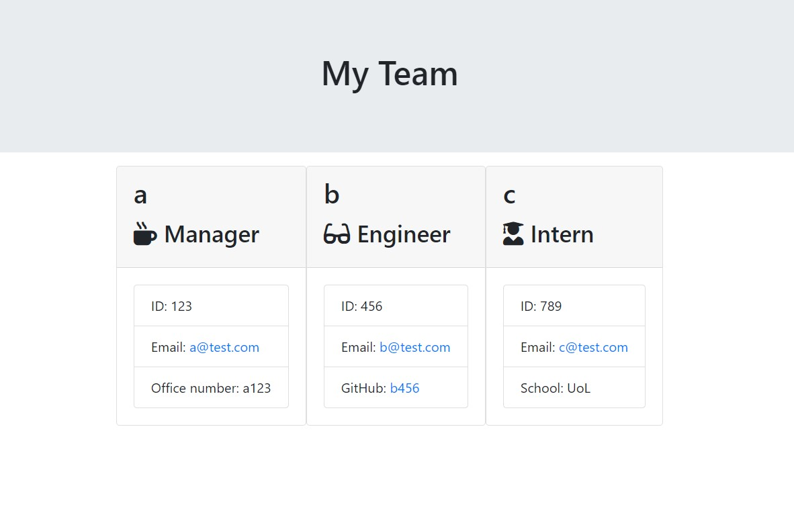
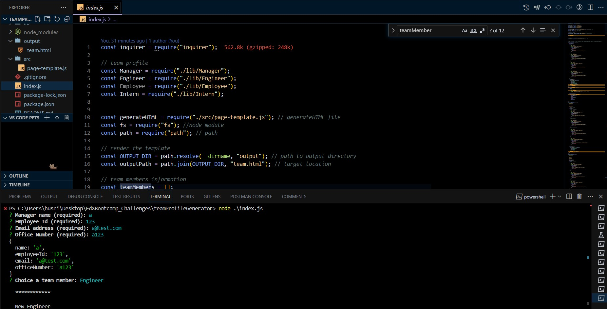

# teamProjectGenerator


## Description
The project helps that to create profile for each team member and team.

## Table of Contents
* [Description](#description)
* [Deployment](#deployment)
* [Demo](#demo)
* [Screenshot](#screenshot)
* [Languages](#languages)
* [Usage](#usage)
* [Contributors](#contributors)
* [Testing](#testing)
* [Author](#author)
* [Repository](#repository)
* [Questions](#questions)

## Deployment
To deploy this project run
```npm run deploy```
## Demo

## Screenshot
teamProfileGenerator Gif


<br>
teamProfileGenerator screenshots
<br>

<br>

## Languages
Javascript, NodeJs
## Usage
This project can be used the purpose of the project create team profile professionally for teams.
## Installation
Install teamProjectGenerator with clone the teamProfileGenerator folder and run the following instructions ```npm install```
## Contributors
Contributions are always welcome!
## Tests
```npm test```
## Author
[@tigerkaplan](https://github.com/tigerkaplan)
## Repository
https://github.com/tigerkaplan/teamProfileGenerator
## Questions
Please send your questions [here](mailto:husniyeerparun@gmailcom?subject=[GitHub]%20Dev%20Connect) or visit [github/tigerkaplan](https://github.com/tigerkaplan) for my other projects on GitHub.
